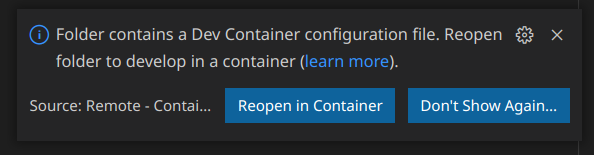
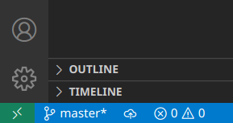
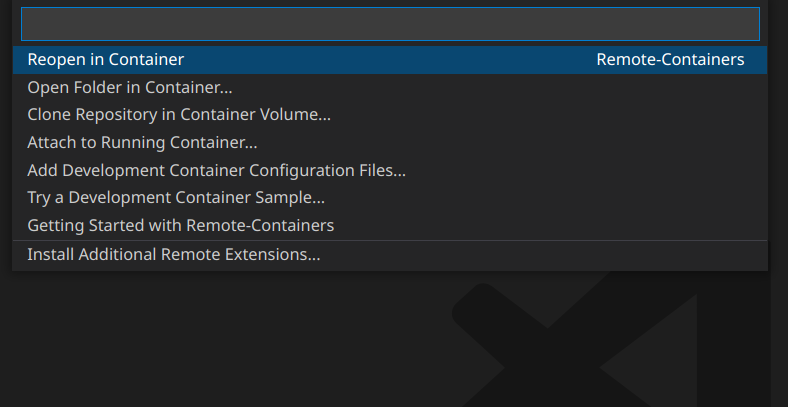
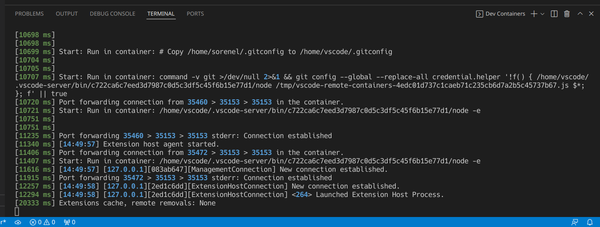
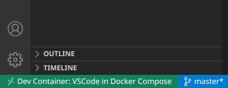

# VSCode in docker-compose

Very basic devcontainer template for microsoft [remote-containers](https://code.visualstudio.com/docs/remote/containers).

## How to use

This is template for any your devcontainer (remote-containers) project.
It is based on ubuntu docker image,
but you can adapt the approach to any linux distro.

- Install vscode [remote-containers extension](https://marketplace.visualstudio.com/items?itemName=ms-vscode-remote.remote-containers)
- Clone this repository to some directory
- (OPTIONAL!) Execute $ ```git checkout short```
  so you dont have to remove all comments, docs and other, quickstart.
- Remove .git directory from cloned directory
- Execute $ ```docker-compose up -d```
- Start vscode in cloned directory
- You should see next popup:


- Just click "Reopen in Container".

### If for some reason popup is not showing up



Click that green button in bottom left corner and you will see next menu:



And just press Enter (on reopen in container menu element). You should see terminal poping up 

Then bottom left of vscode should display
remote-containers extension is active.



## Why?

I tried remote-containers extension and didn't like
standard templates:
- There's bunch of bash code i didn't need
- It depends on container created by microsoft
(what is in? why is it different from base image?)
- It is more oriented on pure docker than docker-compose

So i spent some time making minimal but comfortable
version of microsoft template.

## Compatibility

Tested on linux nixos distro,
probably works on most linux distros.

Not tested on **windows** and **macos**
and probably just not working.
If you manage to add support for windows or macos 
**!without!** breaking anything on linux, 
please send me pull request.
